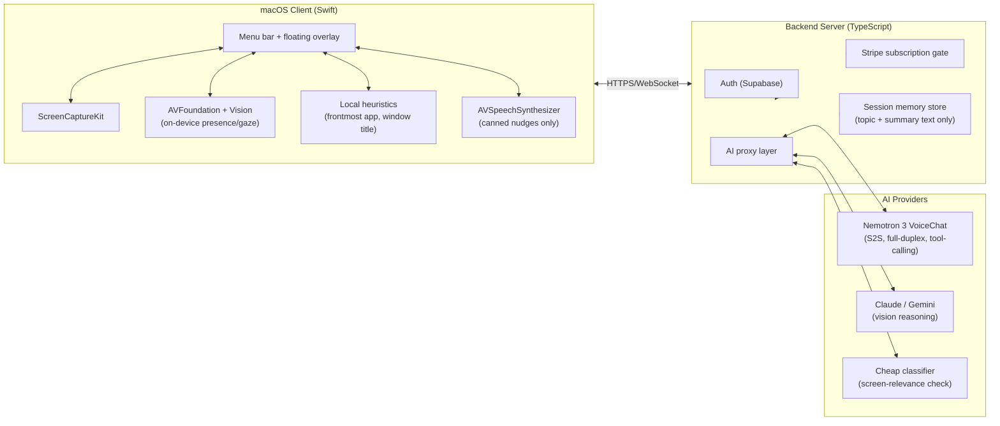

# Architecture

## 1. System overview

**Why native Swift, not Electron:** the app needs `ScreenCaptureKit`, camera + `Vision` framework access, a true always-on-top overlay window, menu bar integration, and Keychain-backed credentials. These are deep OS-level APIs Electron can't access cleanly.

**Why a backend proxy instead of calling AI APIs directly from the client:** this is a paid subscription product, so no API key can live on the user's device — it would be extractable from the app bundle. All AI calls route through the server, which checks subscription status first.

---

## 2. The three voice "jobs" — don't conflate them

| Job | Frequency | What it needs |
|---|---|---|
| **A. Nudges** ("you've been on Instagram a while") | 5–15×/hour, one-way | Good TTS only — no reasoning needed live |
| **B. Voice Q&A** ("explain this diagram") | 2–10×/session, 20–60s each | Full-duplex voice + vision reasoning |
| **C. Ambient presence** | Continuous | Held-open realtime session — expensive if done naively |

**Design decision:** don't hold a realtime voice session open for the whole study session (Job C). Gate it: local monitoring runs for free the whole time; a realtime session opens only when the user activates it (hotkey, or wake word once added) and closes after a short silence timeout. This gets Job C's *feel* at Job B's *cost*.

---

## 3. Core pipelines

### 3.1 Capture pipeline

- **Screen:** `ScreenCaptureKit`, primary display only (v1), on-demand snapshot — not continuous recording.
- **Camera:** `AVFoundation`, continuous local frame stream, analyzed **on-device only**. Frames never leave the device unless the user explicitly asks a camera/book question.

### 3.2 Distraction detection (local-first)

Two independent signals, combined:

1. **Camera presence signal (on-device, no network call)**
   Apple `Vision` / MediaPipe Face Landmarker checks: face present? facing the screen? absent for 15+ continuous seconds? Runs every 2–3s since it's free and local.

2. **Screen-content relevance signal (cloud call, cheap model)**
   Before calling any AI: check `NSWorkspace.shared.frontmostApplication` bundle ID against a known-distracting list (free, local, catches the obvious cases). Only if ambiguous, send a screenshot + session topic to a **cheap/fast model** (e.g. Haiku-class) asking "does this relate to '[topic]'? yes/no + one-line reason," roughly every 20–30s.

Rate-limit nudges to avoid nagging (default: one per 90s, configurable). If a nudge is playing when the user activates voice Q&A, interrupt playback immediately.

### 3.3 Voice Q&A pipeline (Nemotron 3 VoiceChat)

1. User activates listening (hotkey in v1; wake word deferred — see `DECISIONS.md`).
2. Audio streams to the backend, which holds a full-duplex session with Nemotron 3 VoiceChat.
3. **Screen vs. camera routing is handled via tool calling, not a keyword heuristic.** Two tools are registered with the model:
   - `look_at_screen()` — client captures the current screen
   - `look_at_camera()` — client captures the current camera frame
   The model decides which to call from conversational context, speaks a natural "on-hold" message while the client captures and returns the frame, then continues.
4. The captured frame + transcribed question + session topic go to a **vision-capable model** (Claude or Gemini — Nemotron itself takes audio only, not images) for the actual reasoning.
5. The vision model's text response is returned to the voice session and spoken back through Nemotron's TTS output.
6. **Context window constraint:** Nemotron's duplex session has a short (~2 min) reliable context window. The backend must re-inject session context (topic, recent Q&A summary) periodically rather than relying on the model to retain the whole session.

---

## 4. Data & privacy

| Data type | Ever stored? | Ever leaves device? |
|---|---|---|
| Screen snapshots (distraction check) | ❌ Never | ✅ Sent for that one check, then discarded |
| Screen snapshots (Q&A) | ❌ Never | ✅ Sent for that one answer, then discarded |
| Camera frames (presence/gaze) | ❌ Never | ❌ Never — fully on-device |
| Camera frames (book Q&A) | ❌ Never | ✅ Sent for that one answer, then discarded |
| Raw audio (nudges) | ❌ Never | ❌ Never — synthesized on-device |
| Raw audio (voice Q&A) | ❌ Never | ✅ Streamed to the voice provider for that session only |
| Session topic + short text summary | ✅ Stored server-side, tied to account | ✅ (server-side by nature) |
| Distraction event timestamps (not content) | ✅ Stored server-side | ✅ |

**Key principle:** no image, video, or audio is ever written to disk or a database, on-device or server-side. Only derived text (topic, summary, timestamp) is persisted.

> ⚠️ This table assumes a cloud voice provider (Nemotron via NVIDIA's hosted endpoint, or Claude/Gemini for vision). Update it honestly once a provider is finalized — don't ship a privacy claim that isn't true. See the "privacy vs. best-in-class experience" tradeoff in `DECISIONS.md`.

**Required macOS permissions:** Screen Recording, Camera, Microphone, Notifications.

**On-screen transparency:** the overlay always shows a "listening/watching" indicator while a session is active.

---

## 5. Out of scope for v1

- Posture detection/alerts
- Visual session dashboard / analytics UI
- Multi-monitor support (primary display only)
- Windows/cross-platform support
- Group study / multiplayer modes
- Wake-word activation (deferred — v1 uses a hotkey; see `DECISIONS.md`)
